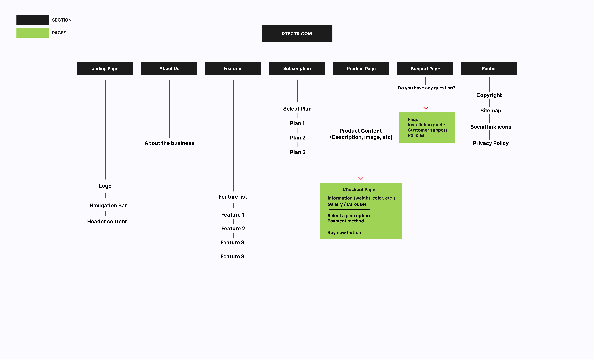

# Dtectr - Redifining Security

Dtectr is a tech startup company selling a video surveillance security camera (CCTV) with the option for online cloud storage. Currently, Dtectr is focused on one product model and one subscription plan with the goal of earning customers’ trust as a secure and reliable seller of CCTVs.

## Product/Service Features

### CCTV hardware

-   High-quality, night vision
-   Motion detection
-   Internet-enabled
-   Remote accessibility
-   Pan, tilt, zoom

### Storage and dashboard

-   Direct-to-cloud transfer and storage
-   World-class security
-   Intelligent storage and download
-   Customizable storage and backup duration
-   Timeline view of footage

